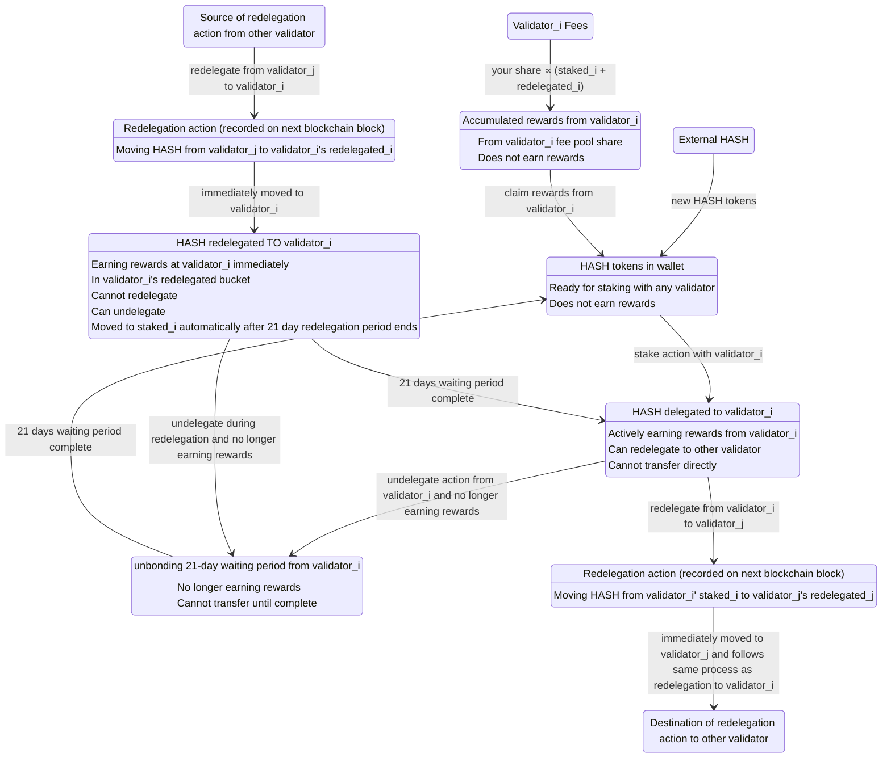

# HASH Token State Diagram - Mermaid Code (Per Validator)



## Key Relationships

**Per-Validator States (Validator_i focus):**
- `staked_i` = HASH staked with validator_i
- `rewarded_i` = HASH rewards earned from validator_i  
- `redelegated_i` = HASH redelegated TO validator_i (in validator_i's redelegated_i bucket)
- `unbonding_i` = HASH unbonding from validator_i

**External Validator_j States:**
- `staked_j` = HASH redelegated from validator_j (external source)
- `redelegated_j` = HASH redelegated to validator_j (external destination)

**Note:** The diagram focuses on validator_i interactions. Validator_j represents external destinations for redelegation, with their own independent reward systems.

**Reward Calculation (Per Validator):**
```
Your reward from validator_i ∝ (staked_i + redelegated_i)
```

Validator_i distributes rewards from its own fee pool. Your share depends only on your stake with validator_i. When HASH is redelegated to validator_j, it becomes part of validator_j's external ecosystem and earns rewards there according to validator_j's rules.

**Total Portfolio Calculation:**
```
total_rewards_from_validator_i = rewarded_i
total_active_stake_with_validator_i = (staked_i + redelegated_i)
total_delegated_with_validator_i = (staked_i + redelegated_i + rewarded_i + unbonding_i)
```

**Cumulative Totals Calculation:**
```
total_staked = sum of staked_i across all validators
total_rewarded = sum of rewarded_i across all validators  
total_redelegated = sum of redelegated_i across all validators
total_unbonding = sum of unbonding_i across all validators
total_delegated = sum of total_delegated_with_validator_i across all validators
```

## Blockchain Transaction Timing

**Immediate Actions (recorded on next Provenance blockchain block):**
- Stake action: `available → staked_i`
- Undelegate action: `staked_i → unbonding_i` 
- Undelegate action: `redelegated_i → unbonding_i` 
- Redelegate action: `staked_i → redelegate_i_to_j → redelegated_j` (to external validator_j)
- Redelegate action: `staked_j → redelegate_j_to_i → redelegated_i` (from external validator_j)
- Claim rewards: `rewarded_i → available` (from validator_i)

**Waiting Period Completions (recorded on next block after 21-day period expires):**
- Unbonding completion: `unbonding_i → available` (from validator_i)
- Redelegation completion: `redelegated_i → staked_i` (from and to validator_i)

**Key Timing Notes:**
- "Immediate" = transaction recorded on next blockchain block
- "21 days complete" = transaction recorded on next block after waiting period expires
- Rewards start earning immediately upon redelegation (same block as redelegate action)
- Rewards are calculated per validator based on your stake with that specific validator
- Validator_j operations follow the same patterns as validator_i but are external to this focused view
- Anti-hopping restrictions apply during the entire 21-day redelegation period